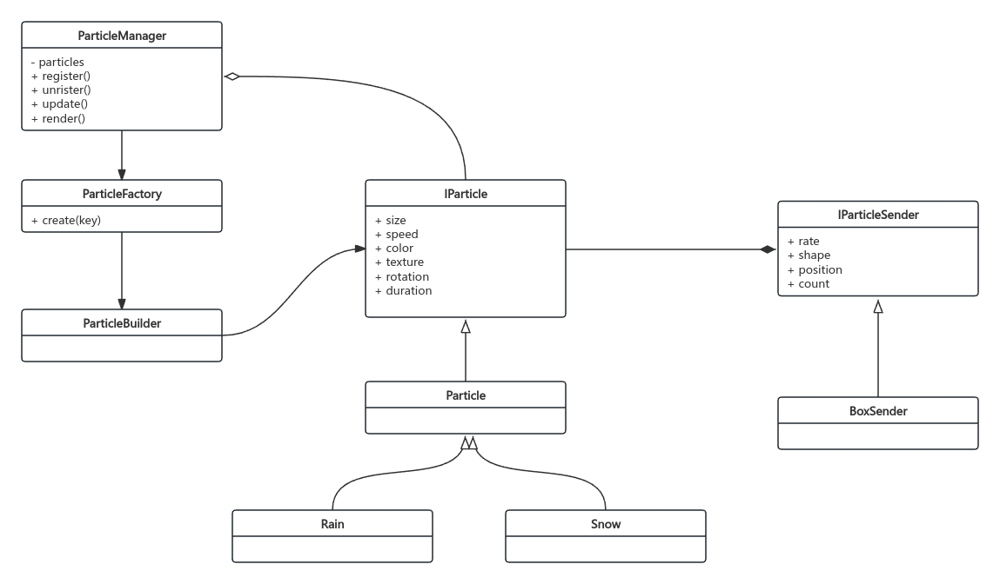

# 1.概述

粒子系统是引擎特性表现的基础， 它可以用于模拟火，烟，雨，云，雪，落叶，爆炸，雾等自然现象。

粒子系统的基本单元是粒子，一个粒子一般具有位置、大小、颜色、速度、加速度、生命周期等属性。

粒子系统的基本组成有：粒子类， 粒子工厂，粒子发射器，粒子管理器等组成

# 2.粒子系统的特点

主要特点：

- **大量**的粒子，所以最好采用GPU计算和渲染来实现。
- **几何图形简单**, 例如点、线、四边形（billboard）或小的3D模型。粒子的形状和大小通常相对较小。
- **粒子独立的运动变化**，具有自己的位置、速度、加速度、颜色、寿命等属性。
- **需要生命周期管理**,每个粒子在其生命周期结束时会被销毁或重生。粒子的生命周期可以用于控制其颜色、透明度、大小等属性的变化。
- **适合GPU计算和渲染**。
- 有其他**交互性**， 如： 碰撞、反弹、重力、摩擦
- **配置参数多**, 如：初始速度，位置，发射角度，发射频率，颜色等

**2.1 渲染大量粒子时，性能优化的常用方法：**

- 使用 Instancing， 一次绘制调用（draw call）中绘制多个相同的几何体
- 使用 Shader，可以在 GPU 上进行粒子的更新和渲染，减少 CPU 的负担。
- 使用 BufferGeometry 代替 Geometry ，因为 BufferGeometry 直接使用 GPU 缓冲区进行渲染，而 Geometry 需要进行更多的 CPU 计算和内存拷贝。
- 优化粒子属性更新，尽量减少 BufferAttribute 的更新频率。
- 使用纹理替代单独的几何体，对于粒子效果，例如烟雾、火焰，使用带有透明度的纹理来代替单独的几何体，可以显著减少顶点数和绘制调用。
- 视锥裁剪, 只渲染在视锥体内的粒子，避免无效的粒子渲染。
- 遮挡采集，被遮挡的粒子不渲染。
- 粒子池, 预先分配粒子，并重用已经销毁的粒子，避免频繁的内存分配和释放。
- 简化的物理和碰撞检测，对粒子的物理和碰撞检测进行简化，减少计算量。例如，可以使用简单的包围盒或球体来代替复杂的碰撞检测。

**2.2 粒子效果增强：**

- [雪花堆积 ](https://threejs.org/examples/?q=particle#webgpu_compute_particles_snow)
- [雨水水花](https://threejs.org/examples/?q=particle#webgpu_compute_particles_rain)
- [反弹](https://threejs.org/examples/?q=particle#webgpu_compute_particles)
- [碰撞检查](https://threejs.org/examples/?q=particle#webgpu_compute_particles_rain)
- 模拟重力
- 方向光
- 环境光

# 3.类图

**说明：**

- **ParticleManager** 管理粒子系统，对其他模块提供粒子相关服务。
- **ParticleFactory** 用于创建各种粒子。
- **ParticleBuilder** 封装粒子的创建。
- **IParticle** 粒子的抽象接口， 每个粒子都有自己的发射器
- **IParticleSender** 用于控制粒子发射的位置，数量，速度

# 4.示例

- [rain](http://192.168.100.37:5173/particle/particleRain.html)
- [snow1](http://192.168.100.37:5173/particle/particleSnow.html)
- [snow2](http://192.168.100.37:5173/particle/particleSprites.html)
- [fire](http://192.168.100.37:5173/particle/particleFlame.html)
- [ball](http://192.168.100.37:5173/particle/particleSand.html)
- [dynamic](http://192.168.100.37:5173/particle/particleDynamic.html)

# 参考资料
- [threejs.example](https://threejs.org/examples/?q=particle)
- [cocos](https://docs.cocos.com/creator/3.3/manual/zh/particle-system/)
- [transform_feedback_separated](https://github.com/WebGLSamples/WebGL2Samples/blob/master/samples/transform_feedback_separated_2.html#L193-L278)